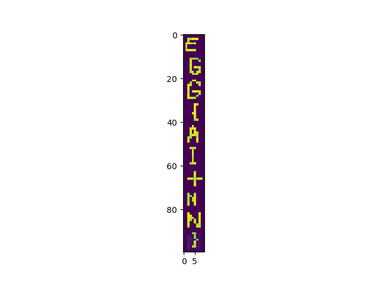

# Kyllinghjerne

```
with open("input.txt") as f: inputs = [[list([(ch=='X')-0.5] for ch in f.readline()[:28]) for b in range(28)] for i in range(10)]
```

ANN, keras, reshape from model show image:

```
_________________________________________________________________
Layer (type)                 Output Shape              Param #   
=================================================================
conv2d (Conv2D)              (None, 26, 26, 10)        100       
_________________________________________________________________
max_pooling2d (MaxPooling2D) (None, 13, 13, 10)        0         
_________________________________________________________________
flatten (Flatten)            (None, 1690)              0         
_________________________________________________________________
dense (Dense)                (None, 10)                16910     
_________________________________________________________________
kylling (Dense)              (None, 100)               1100      
_________________________________________________________________
reshape (Reshape)            (None, 10, 10)            0         
=================================================================
Total params: 18,110
Trainable params: 18,110
Non-trainable params: 0
```
### Output

